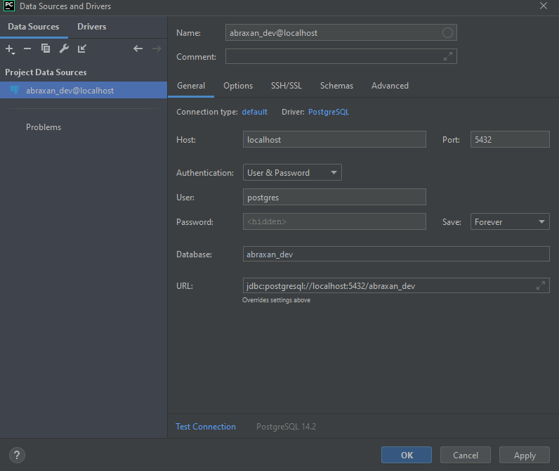

# Projet Abraxan

## Description
Projet annuel de deuxième année à l'ESGI Lyon, Abraxan a pour but de répondre à une réelle problématique de l'école : 
la gestion des contrats formateurs. <br>

Comme pour tout projet Django, Abraxan est divisé en modules afin de facilité son organisation. Actuellement, il ne 
possède que le module Nifleur servant à la gestion des contrats.

## Installation
### Récupération du projet
Tout d'abord, vous devez récupérer le projet en local. Si vous avez accès au github, vous pouvez le cloner en https avec 
la commande suivante :
```bash
git clone https://github.com/Patais/Abraxan.git
```
Vous pouvez également le télécharger et l'installer manuellement.

### Environnement virtuel
Il est conseillé d'utiliser un environnement virtuel pour le projet. Dans notre cas il s'agit de <u>virtualenv</u>. Je 
vous conseille de l'installer via la commande suivante :

```bash
pip install virtualenv
```
Il faut maintenant créer l'environnement virtuel via la commande suivante :
```bash
python3 -m venv /path/de/votre/environnement/virtuel 
```
A partir de maintenant, l'ensemble du projet se passera dans l'environnement virtuel créé à cet effet dans le dossier
venv. Pour activer ce dernier, il suffit de se rendre dans le dossier du projet ressemblant à ceci et de l'activer :


- Windows :
```bash
.\venv\Scripts\activate
```

- Linux & macOs :
```bash
source venv/bin/activate
```

### Dépendances
Maintenant que votre environnement virtuel est activé, vous pouvez installer l'ensemble des dépendances. Pour facilité
cette dernière, un fichier requirements a été mis en place répertoriant l'ensemble des librairies.

```bash
pip install -r requirements.txt
```

### Clef secret & mot de passe
Pour des questions de sécurité, la clef secrète du serveur de django ainsi que le mot de passe de la base de données
sont stockées dans le fichier .env qui est propre à chaque machine. Vous devez donc créer ce fichier dans la racine du
projet et le renseigner de cette manière avec vos données : 

<br>
<u>PS:</u> Pour la base de données, tout est expliqué juste en dessous.

### Base de données
#### Mise en place
Abraxan fonctionne sur une base de données Postgres SQL. Pour la faire fonctionner, il vous faudra l'installer en local:
https://www.enterprisedb.com/downloads/postgres-postgresql-downloads
<br>
Attention à bien garder le mot de passe que vous choisissez lors de l'installation de postgres !

Une fois l'installation effectuée, lancer pgAdmin et connectez vous. Ceci doit ressembler à cela :

Ensuite, faites un clique droit sur base de données -> créer -> base de donnée puis créez une base se nomant 
"abraxan_dev".
Pour finir, vous devez renseigner le mot de passe dans le fichier .env créé juste avant.

#### Pycharm
Si vous utilisez l'IDE pycharm, vous pouvez ajouter la base de donnée à l'éditeur. Pour cela, cliquez sur le bouton 
Dabatase situé en haut à droite et cliquez sur le + -> Data Source -> PostgreSQL puis renseignez les paramètres : <br>


N'hesitez à tester la connexion grâce au texte en bleu en bas.
<br>

#### Migrations
Une fois la base de données en place, il va falloir la migrer. Pour cela Django met en place une commande dans 
le manage.py :
```bash
python manage.py migrate
```

<u>Note de développement :</u> <br>
Si vous mettez à jour des modèles, n'oubliez pas de créer une nouvelle migration avec la commande suivante puis de 
migrer:
```bash
python manage.py makemigration
```

#### Compte
Pour finir avec la base de donnée, il est conseillé de créer un super utilisateur pour travailler en local
```bash
python manage.py createsuperuser
```

### Serveur
Maintenant que votre projet est prêt, il ne vous reste plus qu'à lancer le serveur :
```bash
python manage.py runserver
```
Une fois fait, vous pouvez vous rendre à l'addresse suivante : <b>127.0.0.1:8000</b>
<br>

<u>Note de développement :</u> <br>
Si vous éditez des fichiers python, il est nécessaire de redémarer le serveur pour appliquer les changements. Mais ne
vous inquietez pas, django le fait automatiquement pour vous !

## Support
Si vous rencontrez un problème, vous pouvez contacter un membre du groupe :
- Alexis Barreyre (Développeur logiciel) : alexis.barreyre@gmail.com
- Vincent Sosthene (Administrateur Systèmes & réseaux) : vincent.sosthene74@gmail.com
- Loan Courchinoux-Billonnet (Développeur Django) : loanbillonnet@gmail.com

## License
[MIT](https://choosealicense.com/licenses/mit/)

# Abraxan Project

## Description
As the Annual Project of the second year in ESGI Lyon, the objective of Abraxan is to answer a concrete problem of the 
school :  handling the tutors contracts. <br>

As for any Django Project, Abraxan is divided into modules in order to make its organization easier. Nowadays, Only the 
Nifleur Module (used for the contracts management) is available.

## Installation
### Getting the project
Firstly, get the project locally. If you have access to the github, clone it in https with the following command :
```bash
git clone https://github.com/Patais/Abraxan.git
```
You can also download it and install it manually.

### Virtual Environment
It is recommended using a virtual environment for the project. Here, it is <u>virtualenv</u>. I 
recommend installing it with the following command:
```bash
pip install virtualenv
```
Now create the virtual environment thanks to the following command :
```bash
python3 -m venv /path/de/votre/environnement/virtuel 
```
From now on, the entire project will be handled in the virtual environment created to this end in the venv folder.
To activate it, open the folder on the following screenshot and activate it :


- Windows :
```bash
.\venv\Scripts\activate
```

- Linux & macOs :
```bash
source venv/bin/activate
```

### Dependencies
Now that your virtual environment is activated, you can now install the all the dependencies. To make things easier, a 
requirements file has been setup to index all the libraries. 

```bash
pip install -r requirements.txt
```

### Secret Key and password
For security purpose, the secret key of the django server aswell as the password of the database are stored in the 
.env file which is  specific to one's machine. You will have to create that file in the project's root, and fill it 
like so, with your data :

<br>
<u>PS:</u> For the database, everything is explained right under.

### Database
#### Setting up
Abraxan works on a Postgres SQL database. To make it work, you wil have to install it locally :
https://www.enterprisedb.com/downloads/postgres-postgresql-downloads
<br>
Be careful with keeping the chosen password when installing Postgres !

Once the instalation is finished, start pgAdmin and log in. It should look like that :

Then, right click on database -> create -> database and create a database named "abaraxan_dev"
In the end, you have to fill the password in the .env file created before.

#### Pycharm
If you use the Pycharm IDE, you can add the database to the editor. In order to do this, click on the Database button 
on the top right of the window and click on the '+' -> Data Source -> PostgresSQL and fill in the parameters like so :<br>


Don't hesitate to try the connection thanks to the blue text in the bottom.
<br>

#### Migrations
Once the databse is setup, it requires to be migrated. In order to proceed, Django has a command inside 
of the manage.py file :
```bash
python manage.py migrate
```

<u>Development note :</u> <br>
If you update models, don't forget to create a new migration with the following command and to migrate :
```bash
python manage.py makemigration
```

#### Account
Finally with the databse, it is recommended to create a super user to work locally.
```bash
python manage.py createsuperuser
```

### Server
Now that the project is ready, you just have to start the server :
```bash
python manage.py runserver
```
Once it is done, you can go to the following address : <b>127.0.0.1:8000</b>
<br>

<u>Development note :</u> <br>
If you edit python files, it is mandatory to restart the server to apply the modifications. 
Don't worry, Django does it for you !

## Support
If you encounter an issue, yu can contact a member of the team :
- Alexis Barreyre (Software Developer) : alexis.barreyre@gmail.com
- Vincent Sosthene (System and Networks administrator) : vincent.sosthene74@gmail.com
- Loan Courchinoux-Billonnet (Django Developer) : loanbillonnet@gmail.com


## License
[MIT](https://choosealicense.com/licenses/mit/)
