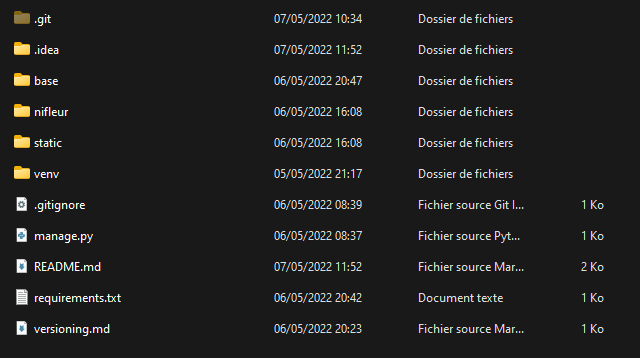
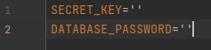
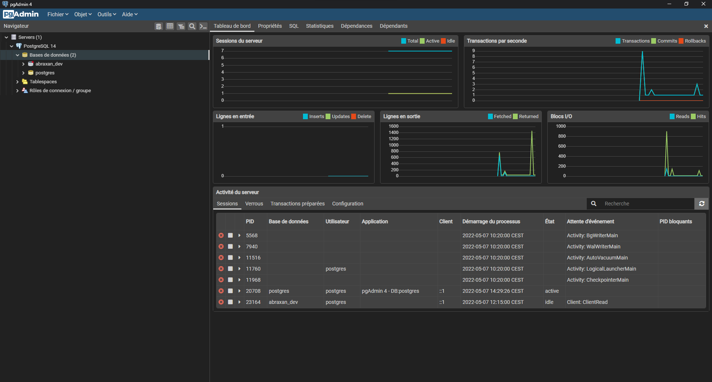
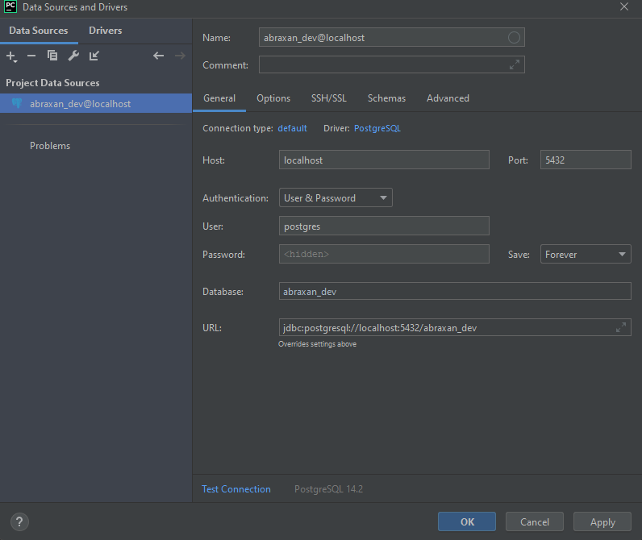

# Abraxan Project

## Description
As the Annual Project of the second year in ESGI Lyon, the objective of Abraxan is to answer a concrete problem of the 
school :  handling the tutors contracts. <br>

As for any Django Project, Abraxan is divided into modules in order to make its organization easier. Nowadays, Only the 
Nifleur Module (used for the contracts management) is available.

## Installation
### Getting the project
Firstly, get the project locally. If you have access to the github, clone it in https with the following command :
```bash
git clone https://github.com/Patais/Abraxan.git
```
You can also download it and install it manually.

### Virtual Environment
It is recommended using a virtual environment for the project. Here, it is <u>virtualenv</u>. I 
recommend installing it with the following command:
```bash
pip install virtualenv
```
Now create the virtual environment thanks to the following command :
```bash
python3 -m venv /path/de/votre/environnement/virtuel 
```
From now on, the entire project will be handled in the virtual environment created to this end in the venv folder.
To activate it, open the folder on the following screenshot and activate it :


- Windows :
```bash
.\venv\Scripts\activate
```

- Linux & macOs :
```bash
source venv/bin/activate
```

### Dependencies
Now that your virtual environment is activated, you can now install the all the dependencies. To make things easier, a 
requirements file has been setup to index all the libraries. 

```bash
pip install -r requirements.txt
```

### Secret Key and password
For security purpose, the secret key of the django server aswell as the password of the database are stored in the 
.env file which is  specific to one's machine. You will have to create that file in the project's root, and fill it 
like so, with your data :

<br>
<u>PS:</u> For the database, everything is explained right under.

### Database
#### Setting up
Abraxan works on a Postgres SQL database. To make it work, you wil have to install it locally :
https://www.enterprisedb.com/downloads/postgres-postgresql-downloads
<br>
Be careful with keeping the chosen password when installing Postgres !

Once the instalation is finished, start pgAdmin and log in. It should look like that :

Then, right click on database -> create -> database and create a database named "abaraxan_dev"
In the end, you have to fill the password in the .env file created before.

#### Pycharm
If you use the Pycharm IDE, you can add the database to the editor. In order to do this, click on the Database button 
on the top right of the window and click on the '+' -> Data Source -> PostgresSQL and fill in the parameters like so :<br>


Don't hesitate to try the connection thanks to the blue text in the bottom.
<br>

#### Migrations
Once the databse is setup, it requires to be migrated. In order to proceed, Django has a command inside 
of the manage.py file :
```bash
python manage.py migrate
```

<u>Development note :</u> <br>
If you update models, don't forget to create a new migration with the following command and to migrate :
```bash
python manage.py makemigration
```

#### Account
Finally with the databse, it is recommended to create a super user to work locally.
```bash
python manage.py createsuperuser
```

### Server
Now that the project is ready, you just have to start the server :
```bash
python manage.py runserver
```
Once it is done, you can go to the following address : <b>127.0.0.1:8000</b>
<br>

<u>Development note :</u> <br>
If you edit python files, it is mandatory to restart the server to apply the modifications. 
Don't worry, Django does it for you !

## Support
If you encounter an issue, yu can contact a member of the team :
- Alexis Barreyre (Software Developer) : alexis.barreyre@gmail.com
- Vincent Sausthene (System and Networks administrator) : vincent.sosthene74@gmail.com
- Loan Courchinoux-Billonnet (Django Developer) : loanbillonnet@gmail.com


## License
[MIT](https://choosealicense.com/licenses/mit/)
